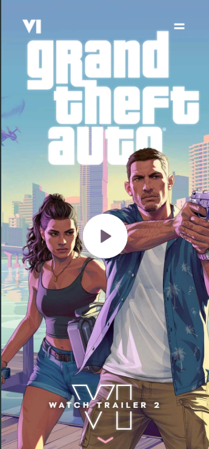

# 🌐 GTA VI

### A recreation of the GTA-VI official website, built using React, Tailwind CSS, and GSAP. Includes all original animations and interactive features, with fully functional UI and responsive design.

## Link 🔗 [https://characterMi.github.io/gta-vi](https://characterMi.github.io/gta-vi)

 

# Preview

 

# Mobile Responsive

# Technologies

 

<ul>
    <li>
        
    </li>
    <li>
        
    </li>
    <li>
        
    </li>
    <li>
        
    </li>
    <li>
        
    </li>
    <li>
        
    </li>
</ul>
